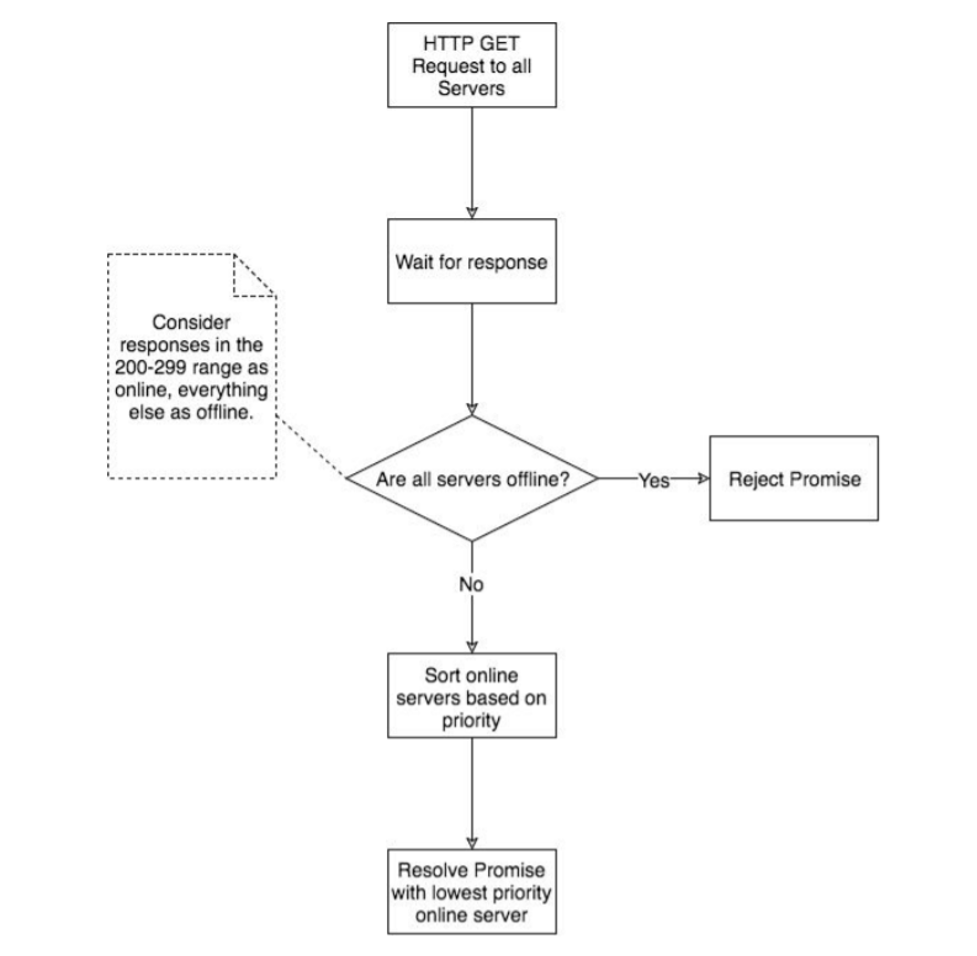
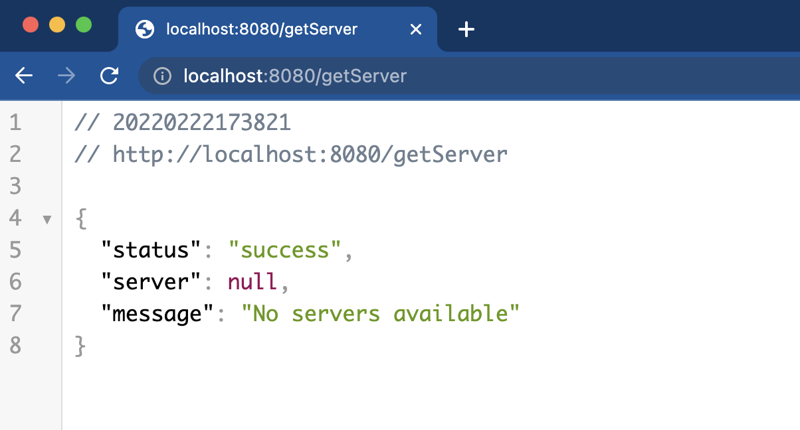
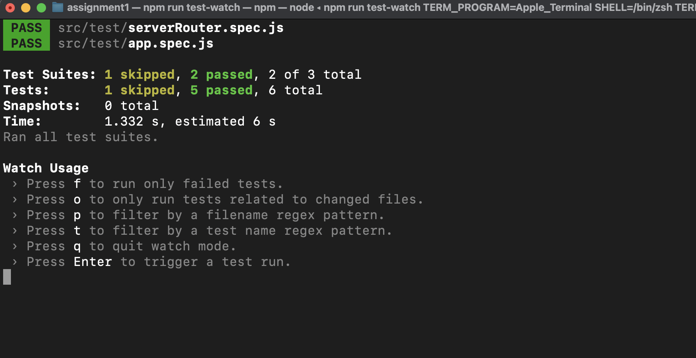

# Assignment 1

Overview You are tasked to create a node module that determines the availability of a given list of
servers and then returns an available server with the lowest priority number. Additionally you should
create sufficient unit tests for this module.



---
## Requirements:

1. Node Module with a `findServer()` function which should return a Promise that either:
    - Resolves with the online server that has the lowest priority number.
    - Rejects with an error, if no Servers are online.

2. HTTP GET requests should be used to determine if a server is online or offline additionally the following is required:
    - All GET requests should be done simultaneously.
    - A GET request should timeout after 5 seconds.
    - A server should be considered online if it’s response status code is between 200 and 299.

3. Unit Tests are required to sufficiently test all components of your module. Additionally the following
is required for unit tests: a. All server interaction should be mocked.

### Example Server Array:
```json
[
    {
        "url": "http://doesNotExist.boldtech.co",
        "priority": 1
    },
    {
        "url": "http://boldtech.co",
        "priority": 7
    },
    {
        "url": "http://offline.boldtech.co",
        "priority": 2
    },
    {
        "url": "http://google.com",
        "priority": 4
    }
]
```

## Installation

Clone the repo and install the dependencies:

Before installing, [download and install Node.js](https://nodejs.org/en/download/).

Installation is done using the
[`npm install`](https://docs.npmjs.com/getting-started/installing-npm-packages-locally) command: 

```bash
$ npm install
````

## Start the server

You can run any one of the below mentioned commands to start the node server

```bash
$ npm start
```

or start the server in develop mode

```bash
$ npm run start-dev
```

This service exposes a GET request. If you open this path in your browser, it automatically make a requests from the server.

* ### **<span style="color:limegreen">GET</span>  /getServer**

```bash
http://localhost:8080/getServer
```




## Run Tests

if you do not want to see the logger output use the command `npm run test-watch`

```bash
$ npm run test
```

or

```bash
$ npm run test-watch
```

## Unit tests
