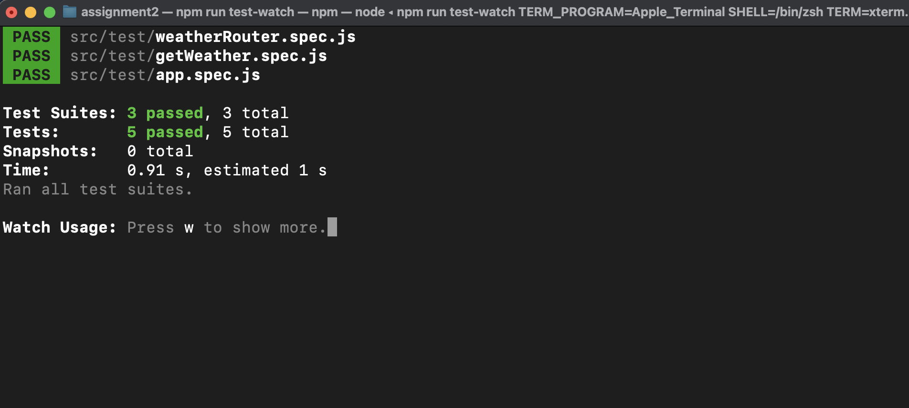

# Assignment 2


[Weather APIs](https://openweathermap.org/api).


---
## Requirements:

- Create a NodeJS API to fetch weather details for a given City using Weather API
- API  will accept city name and read from DB table 
- NodeJS will fetch encrypted Key Secrets from configuration file for authenticating Google Weather API
- NodeJS API will call weather API to get latest weather information and dump this info in DB Table 
- Return weather details in 20 seconds of last call for the same City, API will respond with DB Table dump, post 20 seconds it will go to Google API to get latest weather
- Write Unit Test cases on API.
- Log the API execution in Log files with Date stamp.
- Push this code to public git repo and share link


## Installation

Clone the repo and install the dependencies:

Before installing, [download and install Node.js](https://nodejs.org/en/download/).

Installation is done using the
[`npm install`](https://docs.npmjs.com/getting-started/installing-npm-packages-locally) command: 

```bash
$ npm install
````

## Start the server

You can run any one of the below mentioned commands to start the node server

```bash
$ npm start
```

or start the server in develop mode

```bash
$ npm run start-dev
```

This service exposes a GET request. If you open this path in your browser, it automatically make a requests from the server.

* ### **<span style="color:limegreen">GET</span>  /weather/details/:city**

```bash
http://localhost:8080/weather/details/mexico
```


### Example of successful response
```json
{
  "statusCode": 200,
  "data": {
    "message": "accurate",
    "cod": "200",
    "count": 1,
    "list": [
      {
        "id": 1699805,
        "name": "Mexico",
        "coord": {
          "lat": 15.0646,
          "lon": 120.7198
        },
        "main": {
          "temp": 89.15,
          "feels_like": 89.17,
          "temp_min": 89.15,
          "temp_max": 89.15,
          "pressure": 1014,
          "humidity": 39,
          "sea_level": 1014,
          "grnd_level": 1013
        },
        "dt": 1645675750,
        "wind": {
          "speed": 15.66,
          "deg": 88
        },
        "sys": {
          "country": "PH"
        },
        "rain": null,
        "snow": null,
        "clouds": {
          "all": 8
        },
        "weather": [
          {
            "id": 800,
            "main": "Clear",
            "description": "clear sky",
            "icon": "01d"
          }
        ]
      }
    ]
  }
}
```


### Example of failed response
```json
{
  "statusCode": 400,
  "error": "City 'xd' not found"
}
```

## Run Tests

if you do not want to see the logger output use the command `npm run test-watch`

```bash
$ npm run test
```

or

```bash
$ npm run test-watch
```

## Unit tests
