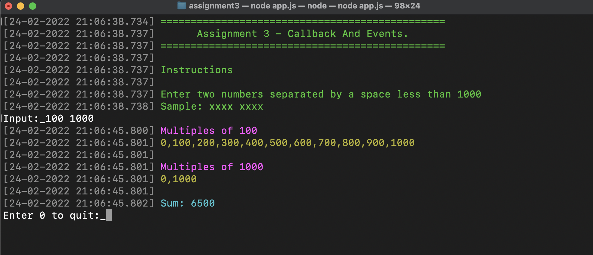

# Assignment 3

NodeJS - Callback And Events 



---
## Requirements:
Callback functions and creating custom events using the events core module in Node. 
Steps To Do: 
1.	The variable input has the input value. 
2.	Extract n1 and n2 from the input. Write a function to find the sum of all the multiples of n1 and n2, below and including 1000. This function should log the sum after 2 seconds.
3.	Register an event named MyEvent for any instance of an event emitter, and bind a function named logInfo to it, which logs "Multiplesof {n1} {n2}"to the console and emit the event.

- Constraints:
    - Input: input, a string separated by space 
    - Output: strings separated by newline 


```bash
Sample Case 0:
Sample Input For Custom Testing 100 1000
Sample Output Multiples of 100 1000 6500
````
Explanation Multiples of 100 are 100,200,300,......1000 and multiples of 1000 is 1000 in below and including 1000. Sum = (100+200+............1000) + 1000 Sum = 6500 

```bash
Sample Case 1 
Sample Input For Custom Testing 500 1200 
Sample Output Multiples of 500 1200 1500
````


## Installation

Clone the repo and install the dependencies:

Before installing, [download and install Node.js](https://nodejs.org/en/download/).

Installation is done using the
[`npm install`](https://docs.npmjs.com/getting-started/installing-npm-packages-locally) command: 

```bash
$ npm install
````

## Start app

You can run the application with the following command

```bash
$ node app.js
```