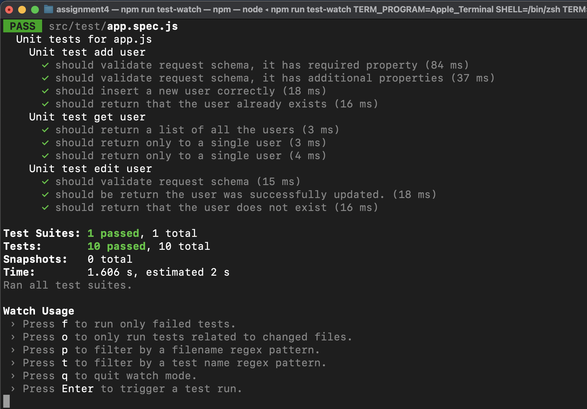
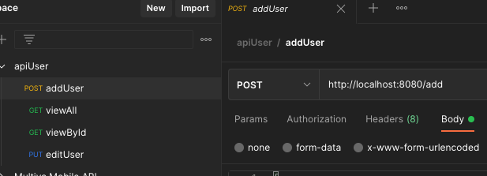

# Assignment 4

## Requirements:

Profile management: Node.js and Express

Create a back-end application using Node.js and Express framework to get post and modify user data from a json file.

## Installation

Clone the repo and install the dependencies:

Before installing, [download and install Node.js](https://nodejs.org/en/download/).

Installation is done using the
[`npm install`](https://docs.npmjs.com/getting-started/installing-npm-packages-locally) command: 

```bash
$ npm install
````

## Start the server

You can run any one of the below mentioned commands to start the node server

```bash
$ npm start
```

or start the server in develop mode

```bash
$ npm run start-dev
```

## Methods

### **<span style="color:red">POST</span> /add**

The endpoints and their functionalities that you need to create are as follows:

#### Example path
```bash
http://localhost:8080/add
````

This route should add the data sent with the request body into the post.json file.

#### Example request
```json
{
    "id": "1",
    "name": "updated name",
    "age": "22",
    "gender": "Male",
    "email": "userone@gmail.com"
}
```

If the data is added successfully, then you should sent a response code of 200.

#### Example response
```json
{
    "status": "Record inserted successfully"
}
```


### **<span style="color:limegreen">GET</span> /view**

This route has a optional query param called id. If no query param get passed with the request then you should fetch all the data from the get.json file. If some id gets passed with the request query param, then you should send the details of the user having id equal to the id that comes with the request query.

#### Example path without query parameter
```bash
http://localhost:8080/view
````
#### Example response
```json
[
    {
        "id": "1",
        "name": "updated name",
        "age": "22",
        "gender": "Male",
        "email": "userone@gmail.com"
    },
    {
        "id": "2",
        "name": "user two",
        "age": "24",
        "gender": "Female",
        "email": "usertwo@gmail.com"
    }
]
```
#### Example path with query parameter /:id
```bash
http://localhost:8080/view/:id
````

#### Example response
```json
{
    "id": "2",
    "name": "user two",
    "age": "24",
    "gender": "Female",
    "email": "usertwo@gmail.com"
}
```

### **<span style="color:skyblue">PUT</span> /edit/:id**

This route should update the values of the of the user having id in post.json equal to the id that comes with the request URL. You can update name, age and email of a user.

#### Example path for edit
```bash
http://localhost:8080/edit/:id 
````
#### Example request
```json
{
    "name": "updated name",
    "age": "223",
    "email": "tes@gmail.com"
}
```

This request should update the name of the user having id 3 in post.json as updated name.
If the data is updated successfully, then you should send a status code of 200.

#### Example response
```json
{
    "status": "Record updated successfully"
}
```

## Run Tests

if you do not want to see the logger output use the command `npm run test-watch`

```bash
$ npm run test
```

or

```bash
$ npm run test-watch
```
## Unit tests


## Notes

The file for importing collections was added in the project

PATH
```bash
assignment4/postmanCollections/apiUser.postman_collection.json
```

You can import the collection into your workspace. 
```bash
https://learning.postman.com/docs/getting-started/importing-and-exporting-data/
```

